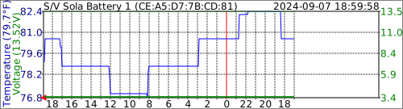

# VictronBTLELogger

The purpose of this program is to listen to Victron Bluetooth LE advertisments, decrypt and log them, and create SVG graphs of the battery voltage and temperature in the style of https://github.com/wcbonner/GoveeBTTempLogger

I've currently got it graphing the two items I'm running most related to my battery situation. SmartLithium Batteries and Orion XS DC/DC Charger.

## Example SVG Output
 

## Useful starting links

https://community.victronenergy.com/questions/187303/victron-bluetooth-advertising-protocol.html

https://www.victronenergy.com/live/open_source:start

https://github.com/keshavdv/victron-ble

## DBus
I'm using the same dbus connection style to BlueZ I recently learned in my Govee project. This project does not link to bluetooth libraries directly. I've duplicated a couple of functions for handling bluetooth address structures safely.

## OpenSSL
I had to learn to use OpenSSL to decrypt the AES CTR blocks that are being sent by Victron. Writing it up is a good idea. 

## Victron Extra Manufacturer Data
Victron confuses details by referring to extra data. 
Decoding the extra manufacturer data, it's all manufacturer data at the bluetooth level. Victron bit packs the extra data before encrypting it using the AES CTR method.

### Manufacturer Data
| Start Byte | Byte Count | Meaning | Remark |
| --- | --- | --- | --- |
| 0 | 1 | Manufacturer Data Record type | 0x10=Product Advertisement |
| 1 | 2 | model id | --- |
| 3 | 1 | read out type 0xA0 | --- |
| 4 | 1 | record type | Used to decide which bit packed structure to decode the extra data. e.g. 0x01=[Solar Charger](#solar-charger-0x01) 0x05=[SmartLithium](#smartlithium-0x05)|
| 5 | 2 | AES Initialization Vector | --- |
| 7 | 1 | First Byte of AES Decryption Key | --- |
| 8 | ? | First Byte of encrypted data | extra manufacturer data |

## Victron Data Structures (extra manufacturer data)

### Solar Charger (0x01)
| Start Bit | Nr of Bits | Meaning | Units | Range | NA Value | Remark |
| --- | --- | --- | --- | --- | --- | --- |
| 32 | 8 | Device state | | 0..0xFE | 0xFF | VE_REG_DEVICE_STATE |
| 40 | 8 | Charger Error | | 0..0xFE | 0xFF | VE_REG_CHR_ERROR_CODE |
| 48 | 16 | Battery voltage | 0.01V | -327.68..327.66 V | 0x7FFF | VE_REG_DC_CHANNEL1_VOLTAGE |
| 64 | 16 | Battery current | 0.1A | -3276.8..3276.6 A | 0x7FFF | VE_REG_DC_CHANNEL1_CURRENT Also negative current because of a possibly connected load |
| 80 | 16 | Yield today | 0.01 kWh | 0..655.34 kWh | 0xFFFF | VE_REG_CHR_TODAY_YIELD 655.34 kWh is 27.3 kW@24h |
| 96 | 16 | PV power | 1W | 0..65534W | 0xFFFF | VE_REG_DC_INPUT_POWER (un32 @ 0.01W) |
| 112 | 9 | Load current | 0.1A | 0..51.0 A | 0x1FF | VE_REG_DC_OUTPUT_CURRENT |
| 121 | 39 | Unused |

### DC/DC Converter (0x04)
| Start Bit | Nr of Bits | Meaning | Units | Range | NA Value | Remark |
| --- | --- | --- | --- | --- | --- | --- |
| 32 | 8 | Device state | | 0..0xFE | 0xFF | VE_REG_DEVICE_STATE |
| 40 | 8 | Charger Error | | 0..0xFE | 0xFF | VE_REG_CHR_ERROR_CODE |
| 48 | 16 | Input voltage | 0.01V | 0..655.34 V | 0xFFFF | VE_REG_DC_INPUT_VOLTAGE |
| 64 | 16 | Output voltage | 0.01V | -327.68..327.66V | 0x7FFF | VE_REG_DC_CHANNEL1_VOLTAGE |
| 80 | 32 | Off reason | | 0..0xFFFFFFFF | | VE_REG_DEVICE_OFF_REASON_2 |
| 112 | 48 | Unused |

### SmartLithium (0x05)
| Start Bit | Nr of Bits | Meaning | Units | Range | NA Value | Remark |
| --- | --- | --- | --- | --- | --- | --- |
| 32 | 32 | BMS flags | | 0..0xFFFFFFFF | | VE_REG_BMS_FLAGs |
| 64 | 16 | SmartLithium error | | 0..0xFFFF | | VE_REG_SMART_LITHIUM_ERROR_FLAGS |
| 80 | 7 | Cell 1 | 0.01V | 2.60..3.86 V | 0xFF | VE_REG_BATTERY_CELL_VOLTAGE* |
| 87 | 7 | Cell 2 | 0.01V | 2.60..3.86 V | 0xFF | VE_REG_BATTERY_CELL_VOLTAGE* |
| 94 | 7 | Cell 3 | 0.01V | 2.60..3.86 V | 0xFF | VE_REG_BATTERY_CELL_VOLTAGE* |
| 101 | 7 | Cell 4 | 0.01V | 2.60..3.86 V | 0xFF | VE_REG_BATTERY_CELL_VOLTAGE* |
| 108 | 7 | Cell 5 | 0.01V | 2.60..3.86 V | 0xFF | VE_REG_BATTERY_CELL_VOLTAGE* |
| 115 | 7 | Cell 6 | 0.01V | 2.60..3.86 V | 0xFF | VE_REG_BATTERY_CELL_VOLTAGE* |
| 122 | 7 | Cell 7 | 0.01V | 2.60..3.86 V | 0xFF | VE_REG_BATTERY_CELL_VOLTAGE* |
| 129 | 7 | Cell 8 | 0.01V | 2.60..3.86 V | 0xFF | VE_REG_BATTERY_CELL_VOLTAGE* |
| 136 | 12 | Battery voltage | 0.01V | 0..40.94 V | 0x0FFF | VE_REG_DC_CHANNEL1_VOLTAGE |
| 148 | 4 | Balancer status | | 0..15 | 0x0F | VE_REG_BALANCER_STATUS |
| 152 | 7 | Battery temperature | 1°C | -40..86 °C | 0x7F | VE_REG_BAT_TEMPERATURE Temperature = Record value - 40 |
| 159 | 1 | Unused |

* VE_REG_BATTERY_CELL_VOLTAGE
0x00 ( 0) when cell voltage < 2.61V
0x01 ( 1) when cell voltage == 2.61V
0x7D (125) when cell voltage == 3.85V
0x7E (126) when cell voltage > 3.85
0x7F (127) when cell voltage is not available / unknown

### (Lynx Smart) BMS (0x0A)
| Start Bit | Nr of Bits | Meaning | Units | Range | NA Value | Remark |
| --- | --- | --- | --- | --- | --- | --- |
| 32 | 8 | Error | 0x0 | VE_REG_BMS_ERROR
| 40 | 16 | TTG | 1min | 0..45.5 days | 0xFFFF | VE_REG_TTG |
| 56 | 16 | Battery voltage | 0.01V | -327.68..327.66 V | 0x7FFF | VE_REG_DC_CHANNEL1_VOLTAGE |
| 72 | 16 | Battery current | 0.1A | -3276.8..3276.6 | 0x7FFF | VE_REG_DC_CHANNEL1_CURRENT |
| 88 | 16 | IO status | | | 0x0 |  VE_REG_BMS_IO |
| 104 | 18 | Warnings/Alarms | | | 0x0 | VE_REG_BMS_WARNINGS_ALARMS |
| 122 | 10 | SOC | 0.1% | 0..100.0% | 0x3FF | VE_REG_SOC |
| 132 | 20 | Consumed Ah | 0.1 Ah | -104,857..0 Ah | 0xFFFFF | VE_REG_CAH Consumed Ah = -Record value |
| 152 | 7 | Temperature | °C | -40..86 °C | 0x7F | VE_REG_BAT_TEMPERATURE Temperature = Record value - 40 |
| 159 | 1 | Unused |

### Orion XS (0x0F)
| Start Bit | Nr of Bits | Meaning | Units | Range | NA Value | Remark |
| --- | --- | --- | --- | --- | --- | --- |
| 0 | 8 | Device State |  | 0..0xFF |  | VE_REG_DEVICE_STATE |
| 8 | 8 | Error Code |  | 0..0xFF |  | VE_REG_CHR_ERROR_CODE |
| 16 | 16 | Output Voltage | 0.01V | -327.68..327.66 V | 0x7FFF | VE_REG_DC_CHANNEL1_VOLTAGE |
| 32 | 16 | Output Current | 0.01V | -327.68..327.66 A | 0x7FFF | VE_REG_DC_CHANNEL1_CURRENT |
| 48 | 16 | Input Voltage | 0.01V | 0..655.34 V | 0xFFFF | VE_REG_DC_INPUT_VOLTAGE |
| 64 | 16 | Input Current | 0.01V | 0..655.34 A | 0xFFFF | VE_REG_DC_INPUT_CURRENT |
| 80 | 32 | Device Off Reason |  | 0..429496728 |  | VE_REG_DEVICE_OFF_REASON_2 |
| 112 | 16 | Unused |  |  |  |  |
