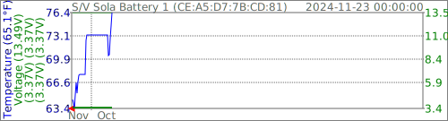

# VictronBTLELogger

Recieve Victron Bluetooth LE advertisments. Decrypt and log data by bluetooth address. Create SVG graphs of battery voltage and temperature in the style of https://github.com/wcbonner/GoveeBTTempLogger

Currently graphing SmartLithium Battery and Orion XS DC/DC Charger.

## Example SVG Output
       

## Quick Build Instructions
```sh
sudo apt install build-essential cmake git libdbus-1-dev libssl-dev
git clone https://github.com/wcbonner/VictronBTLELogger.git
cmake -S VictronBTLELogger -B VictronBTLELogger/build
cmake --build VictronBTLELogger/build
pushd VictronBTLELogger/build && cpack . && popd
```
Create file `/etc/victronbtlelogger/victronencryptionkeys.txt` in the following format using encryption keys captured from the VictronConnect App
```
CE:A5:D7:7B:CD:81  D9AB754E122C1234567890252795729F
F9:48:CF:18:57:62  18C16EB18D3B12345678908B10B9140C
```

## Useful starting links

https://community.victronenergy.com/questions/187303/victron-bluetooth-advertising-protocol.html

https://www.victronenergy.com/live/open_source:start

https://github.com/keshavdv/victron-ble

## DBus
I'm using the same dbus connection style to BlueZ I recently learned in my [Govee project](/wcbonner/GoveeBTTempLogger). This project does not link to bluetooth libraries directly. I've duplicated a couple of functions for handling bluetooth address structures safely.
```
#include <iomanip>
#include <iostream>
#include <regex>

#ifndef bdaddr_t
  /* BD Address */
  typedef struct {
    uint8_t b[6];
  } __attribute__((packed)) bdaddr_t;
#endif // !bdaddr_t
bool operator <(const bdaddr_t& a, const bdaddr_t& b)
{
  unsigned long long A = a.b[5];
  A = A << 8 | a.b[4];
  A = A << 8 | a.b[3];
  A = A << 8 | a.b[2];
  A = A << 8 | a.b[1];
  A = A << 8 | a.b[0];
  unsigned long long B = b.b[5];
  B = B << 8 | b.b[4];
  B = B << 8 | b.b[3];
  B = B << 8 | b.b[2];
  B = B << 8 | b.b[1];
  B = B << 8 | b.b[0];
  return(A < B);
}
bool operator ==(const bdaddr_t& a, const bdaddr_t& b)
{
  unsigned long long A = a.b[5];
  A = A << 8 | a.b[4];
  A = A << 8 | a.b[3];
  A = A << 8 | a.b[2];
  A = A << 8 | a.b[1];
  A = A << 8 | a.b[0];
  unsigned long long B = b.b[5];
  B = B << 8 | b.b[4];
  B = B << 8 | b.b[3];
  B = B << 8 | b.b[2];
  B = B << 8 | b.b[1];
  B = B << 8 | b.b[0];
  return(A == B);
}
std::string ba2string(const bdaddr_t& TheBlueToothAddress)
{
  std::ostringstream oss;
  for (auto i = 5; i >= 0; i--)
  {
    oss << std::hex << std::uppercase << std::setw(2) << std::setfill('0') << static_cast<int>(TheBlueToothAddress.b[i]);
    if (i > 0)
      oss << ":";
  }
  return (oss.str());
}
const std::regex BluetoothAddressRegex("((([[:xdigit:]]{2}:){5}))[[:xdigit:]]{2}");
bdaddr_t string2ba(const std::string& TheBlueToothAddressString)
{ 
  bdaddr_t TheBlueToothAddress({ 0 });
  if (std::regex_match(TheBlueToothAddressString, BluetoothAddressRegex))
  {
    std::stringstream ss(TheBlueToothAddressString);
    std::string byteString;
    int index(5);
    // Because I've verified the string format with regex I can safely run this loop knowing it'll get 6 bytes
    while (std::getline(ss, byteString, ':'))
      TheBlueToothAddress.b[index--] = std::stoi(byteString, nullptr, 16);
  }
  return(TheBlueToothAddress); 
}
```

## OpenSSL
I had to learn to use OpenSSL to decrypt the AES CTR blocks that are being sent by Victron. This was very quick and dirty, but works.
```
#include <openssl/evp.h> // sudo apt install libssl-dev

uint8_t DecryptedData[32] { 0 };
if (sizeof(DecryptedData) >= (ManufacturerData.size() - 8)) // simple check to make sure we don't buffer overflow
{
  EVP_CIPHER_CTX* ctx = EVP_CIPHER_CTX_new();
  if (ctx != 0)
  {
    uint8_t InitializationVector[16] { ManufacturerData[5], ManufacturerData[6], 0}; // The first two bytes are assigned, the rest of the 16 are padded with zero

    if (1 == EVP_DecryptInit_ex(ctx, EVP_aes_128_ctr(), NULL, EncryptionKey.data(), InitializationVector))
    {
      int len(0);
      if (1 == EVP_DecryptUpdate(ctx, DecryptedData, &len, ManufacturerData.data() + 8, ManufacturerData.size() - 8))
      {
        if (1 == EVP_DecryptFinal_ex(ctx, DecryptedData + len, &len))
        {
          // We have decrypted data!
          ManufacturerData[5] = ManufacturerData[6] = ManufacturerData[7] = 0; // I'm writing a zero here to remind myself I've decoded the data already
          for (auto index = 0; index < ManufacturerData.size() - 8; index++) // copy the decoded data over the original data
            ManufacturerData[index+8] = DecryptedData[index];
        }
      }
    }
    EVP_CIPHER_CTX_free(ctx);
  }
}
```

## Victron Extra Manufacturer Data
Victron refers to Extra Manufacturer Data.
It's all manufacturer data at the bluetooth level.
What Victron refers to as "Extra Manufacturer Data" starts at the 8th byte of the manufacturer data, and runs to the end of the Bluetooth Manufacturer Data record.
Decoding the extra manufacturer data, Victron bit packs the extra data before encrypting it using the AES CTR method.

### Manufacturer Data
| Start Byte | Byte Count | Meaning | Remark |
| --- | --- | --- | --- |
| 0 | 1 | Manufacturer Data Record type | 0x10=Product Advertisement |
| 1 | 2 | model id | |
| 3 | 1 | read out type | 0xA0 |
| 4 | 1 | record type | Used to decide which bit packed structure to decode the extra data. e.g. 0x01=[Solar Charger](#solar-charger-0x01) 0x05=[SmartLithium](#smartlithium-0x05)|
| 5 | 2 | AES Initialization Vector | two bytes, pad with 14 more 0x00 values to have a 16 byte array. sometimes called "nonce" |
| 7 | 1 | First Byte of AES Decryption Key | If this doesn't match the stored key, skip attempting to decode |
| 8 | ? | First Byte of encrypted data | Extra Manufacturer Data |

## Victron Data Structures (Extra Manufacturer Data)

### Solar Charger (0x01)
| Start Bit | Nr of Bits | Meaning | Units | Range | NA Value | Remark |
| --- | --- | --- | --- | --- | --- | --- |
| 0 | 8 | Device state | | 0..0xFE | 0xFF | VE_REG_DEVICE_STATE |
| 8 | 8 | Charger Error | | 0..0xFE | 0xFF | VE_REG_CHR_ERROR_CODE |
| 16 | 16 | Battery voltage | 0.01V | -327.68..327.66 V | 0x7FFF | VE_REG_DC_CHANNEL1_VOLTAGE |
| 32 | 16 | Battery current | 0.1A | -3276.8..3276.6 A | 0x7FFF | VE_REG_DC_CHANNEL1_CURRENT Also negative current because of a possibly connected load |
| 48 | 16 | Yield today | 0.01kWh | 0..655.34 kWh | 0xFFFF | VE_REG_CHR_TODAY_YIELD 655.34 kWh is 27.3 kW@24h |
| 64 | 16 | PV power | 1W | 0..65534 W | 0xFFFF | VE_REG_DC_INPUT_POWER (un32 @ 0.01W) |
| 80 | 9 | Load current | 0.1A | 0..51.0 A | 0x1FF | VE_REG_DC_OUTPUT_CURRENT |
| 89 | 39 | Unused |

### Battery Monitor (0x02)
| Start Bit | Nr of Bits | Meaning | Units | Range | NA Value | Remark |
| --- | --- | --- | --- | --- | --- | --- |
| 0 | 16 | TTG | 1min | 0 .. 45.5 days | 0xFFFF | VE_REG_TTG |
| 16 | 16 | Battery voltage | 0.01V | -327.68..327.66 V | 0x7FFF | VE_REG_DC_CHANNEL1_VOLTAGE |
| 32 | 16 | Alarm reason | | 0..0xFFFF | | VE_REG_ALARM_REASON |
| 48 | 16 | Aux voltage | 0.01V | -327.68..327.64 V | | VE_REG_DC_CHANNEL2_VOLTAGE |
| 64 | 16 | Mid voltage | 0.01V | 0..655.34 V | | VE_REG_BATTERY_MID_POINT_VOLTAGE |
| 80 | 16 | Temperature | 0.01K | 0..655.34 K | | VE_REG_BAT_TEMPERATURE |
| 96 | 2 | Aux input | | 0..3 | 0x3 | VE_REG_BMV_AUX_INPUT 0 ⇒ Aux voltage : VE_REG_DC_CHANNEL2_VOLTAGE 1 ⇒ Mid voltage : VE_REG_BATTERY_MID_POINT_VOLTAGE 2 ⇒ Temperature : VE_REG_BAT_TEMPERATURE 3 ⇒ none |
| 98 | 22 | Battery current | 0.001A | -4194..4194 A | 0x3FFFFF | VE_REG_DC_CHANNEL1_CURRENT_MA |
| 120 | 20 | Consumed Ah | 0.1Ah | -104,857..0 Ah | 0xFFFFF | VE_REG_CAH Consumed Ah = -Record value |
| 140 | 10 | SOC | 0.1% | 0..100.0% | 0x3FF | VE_REG_SOC |
| 150 | 10 | Unused |

### Inverter (0x03)
| Start Bit | Nr of Bits | Meaning | Units | Range | NA Value | Remark |
| --- | --- | --- | --- | --- | --- | --- |
| 0 | 8 | Device state |  | 0..0xFE | 0xFF | VE_REG_DEVICE_STATE |
| 8 | 16 | Alarm Reason | | 0..0xFFFF | | VE_REG_ALARM_REASON |
| 24 | 16 | Battery voltage | 0.01V | -327.68..327.66 V | 0x7FFF | VE_REG_DC_CHANNEL1_VOLTAGE |
| 40 | 16 | AC Apparent power | 1VA | 0..65534 VA | 0xFFFF | VE_REG_AC_OUT_APPARENT_POWER |
| 56 | 15 | AC voltage | 0.01V | 0..327.66 V | 0x7FFF | VE_REG_AC_OUT_VOLTAGE |
| 71 | 11 | AC current | 0.1A | 0..204.6 A | 0x7FF | VE_REG_AC_OUT_CURRENT |
| 82 | 46 | Unused |

### DC/DC Converter (0x04)
| Start Bit | Nr of Bits | Meaning | Units | Range | NA Value | Remark |
| --- | --- | --- | --- | --- | --- | --- |
| 0 | 8 | Device state | | 0..0xFE | 0xFF | VE_REG_DEVICE_STATE |
| 8 | 8 | Charger Error | | 0..0xFE | 0xFF | VE_REG_CHR_ERROR_CODE |
| 16 | 16 | Input voltage | 0.01V | 0..655.34 V | 0xFFFF | VE_REG_DC_INPUT_VOLTAGE |
| 32 | 16 | Output voltage | 0.01V | -327.68..327.66V | 0x7FFF | VE_REG_DC_CHANNEL1_VOLTAGE |
| 48 | 32 | Off reason | | 0..0xFFFFFFFF | | VE_REG_DEVICE_OFF_REASON_2 |
| 80 | 48 | Unused |

### SmartLithium (0x05)
| Start Bit | Nr of Bits | Meaning | Units | Range | NA Value | Remark |
| --- | --- | --- | --- | --- | --- | --- |
| 0 | 32 | BMS flags | | 0..0xFFFFFFFF | | VE_REG_BMS_FLAGs |
| 32 | 16 | SmartLithium error | | 0..0xFFFF | | VE_REG_SMART_LITHIUM_ERROR_FLAGS |
| 48 | 7 | Cell 1 | 0.01V | 2.60..3.86 V | 0x7F | VE_REG_BATTERY_CELL_VOLTAGE* |
| 55 | 7 | Cell 2 | 0.01V | 2.60..3.86 V | 0x7F | VE_REG_BATTERY_CELL_VOLTAGE* |
| 62 | 7 | Cell 3 | 0.01V | 2.60..3.86 V | 0x7F | VE_REG_BATTERY_CELL_VOLTAGE* |
| 69 | 7 | Cell 4 | 0.01V | 2.60..3.86 V | 0x7F | VE_REG_BATTERY_CELL_VOLTAGE* |
| 76 | 7 | Cell 5 | 0.01V | 2.60..3.86 V | 0x7F | VE_REG_BATTERY_CELL_VOLTAGE* |
| 83 | 7 | Cell 6 | 0.01V | 2.60..3.86 V | 0x7F | VE_REG_BATTERY_CELL_VOLTAGE* |
| 90 | 7 | Cell 7 | 0.01V | 2.60..3.86 V | 0x7F | VE_REG_BATTERY_CELL_VOLTAGE* |
| 97 | 7 | Cell 8 | 0.01V | 2.60..3.86 V | 0x7F | VE_REG_BATTERY_CELL_VOLTAGE* |
| 104 | 12 | Battery voltage | 0.01V | 0..40.94 V | 0x0FFF | VE_REG_DC_CHANNEL1_VOLTAGE |
| 116 | 4 | Balancer status | | 0..15 | 0x0F | VE_REG_BALANCER_STATUS |
| 120 | 7 | Battery temperature | 1°C | -40..86 °C | 0x7F | VE_REG_BAT_TEMPERATURE Temperature = Record value - 40 |
| 127 | 1 | Unused |

* VE_REG_BATTERY_CELL_VOLTAGE
0x00 ( 0) when cell voltage < 2.61V
0x01 ( 1) when cell voltage == 2.61V
0x7D (125) when cell voltage == 3.85V
0x7E (126) when cell voltage > 3.85
0x7F (127) when cell voltage is not available / unknown

### Inverter RS (0x06)
| Start Bit | Nr of Bits | Meaning | Units | Range | NA Value | Remark |
| --- | --- | --- | --- | --- | --- | --- |
| 0 | 8 | Device state | | 0..0xFE | 0xFF | VE_REG_DEVICE_STATE |
| 8 | 8 | Charger Error | | 0..0xFE | 0xFF | VE_REG_CHR_ERROR_CODE |
| 16 | 16 | Battery voltage | 0.01V | -327.68..327.66 V | 0x7FFF | VE_REG_DC_CHANNEL1_VOLTAGE |
| 32 | 16 | Battery current | 0.1A | -3276.8 ..3276.6 A | 0x7FFF | VE_REG_DC_CHANNEL1_CURRENT |
| 48 | 16 | PV power | 1W | 0..65,534 W | 0xFFFF | VE_REG_DC_INPUT_POWER |
| 64 | 16 | Yield today | 0.01kWh | 0..655.34 kWh | 0xFFFF | VE_REG_CHR_TODAY_YIELD 655.34 kWh is 27.3 kW@24h |
| 80 | 16 | AC out power | 1W | -32,768..32,766 W | 0x7FFF | VE_REG_AC_OUT_REAL_POWER |
| 96 | 32 | Unused |

### GX-Device (0x07)
Record layout is still to be determined and might change.

| Start Bit | Nr of Bits | Meaning | Units | Range | NA Value | Remark |
| --- | --- | --- | --- | --- | --- | --- |
| 0 | 16 | Battery voltage | 0.01 V | 0..655.34V | 0xFFFF | VE_REG_DC_CHANNEL1_VOLTAGE |
| 16 | 20 | PV power | W | 0..1 MW | 0xFFFFF | VE_REG_DC_INPUT_POWER |
| 36 | 7 | SOC | 1% | 0..100% | 0x7F | VE_REG_SOC |
| 43 | 21 | Battery power | W | -1..1 MW | 0x0FFFFF | VE_REG_DC_CHANNEL1_POWER |
| 64 | 21 | DC power | W | -1..1 MW | 0x0FFFFF |
| | | TBD - AC in power |
| | | TBD - AC out power |
| | | TBD - Warnings / Alarms |
| | | TBD |
| 117 | 43 | Unused |

### AC Charger (0x08)
Record layout is still to be determined and might change.

| Start Bit | Nr of Bits | Meaning | Units | Range | NA Value | Remark |
| --- | --- | --- | --- | --- | --- | --- |
| 0 | 8 | Device state | | 0..0xFE | 0xFF | VE_REG_DEVICE_STATE |
| 8 | 8 | Charger Error | | 0..0xFE | 0xFF | VE_REG_CHR_ERROR_CODE |
| 16 | 13 | Battery voltage 1 | 0.01V | 0..81.90 V | 0x1FFF | VE_REG_DC_CHANNEL1_VOLTAGE |
| 29 | 11 | Battery current 1 | 0.1A | 0..204.6 A | 0x7FF | VE_REG_DC_CHANNEL1_CURRENT |
| 40 | 13 | Battery voltage 2 | 0.01 V | 0..81.90 V | 0x1FFF | VE_REG_DC_CHANNEL2_VOLTAGE |
| 53 | 11 | Battery current 2 | 0.1A | 0..204.6 A | 0x7FF | VE_REG_DC_CHANNEL2_CURRENT |
| 64 | 13 | Battery voltage 3 | 0.01V | 0..81.90 V | 0x1FFF | VE_REG_DC_CHANNEL3_VOLTAGE |
| 77 | 11 | Battery current 3 | 0.1A | 0..204.6 A | 0x7FF | VE_REG_DC_CHANNEL3_CURRENT |
| 88 | 7 | Temperature | °C | -40..86 °C | 0x7F | VE_REG_BAT_TEMPERATURE Temperature = Record value - 40
| 95 | 9 | AC current | 0.1A | 0..51.0 A | 0x1FF | VE_REG_AC_ACTIVE_INPUT_L1_CURRENT |
| 104 | 24 | Unused |

### Smart Battery Protect (0x09)
| Start Bit | Nr of Bits | Meaning | Units | Range | NA Value | Remark |
| --- | --- | --- | --- | --- | --- | --- |
| 0 | 8 | Device state | | 0..0xFE | 0xFF | VE_REG_DEVICE_STATE |
| 8 | 8 | Output state | | 0..0xFE | 0xFF | VE_REG_DC_OUTPUT_STATUS |
| 16 | 8 | Error code | | 0..0xFE | 0xFF | VE_REG_CHR_ERROR_CODE |
| 24 | 16 | Alarm reason | | 0..0xFFFF | | VE_REG_ALARM_REASON |
| 40 | 16 | Warning reason | | 0..0xFFFF | | VE_REG_WARNING_REASON |
| 56 | 16 | Input voltage | 0.01V | 327.68..327.66V | 0x7FFF | VE_REG_DC_CHANNEL1_VOLTAGE |
| 72 | 16 | Output voltage | 0.01V | 0..655.34 V | 0xFFFF | VE_REG_DC_OUTPUT_VOLTAGE |
| 88 | 32 | Off reason | | 0..0xFFFFFFFF | | VE_REG_DEVICE_OFF_REASON_2 |
| 120 | 32 | Unused |

### (Lynx Smart) BMS (0x0A)
| Start Bit | Nr of Bits | Meaning | Units | Range | NA Value | Remark |
| --- | --- | --- | --- | --- | --- | --- |
| 0 | 8 | Error | 0x0 | VE_REG_BMS_ERROR
| 8 | 16 | TTG | 1min | 0..45.5 days | 0xFFFF | VE_REG_TTG |
| 24 | 16 | Battery voltage | 0.01V | -327.68..327.66 V | 0x7FFF | VE_REG_DC_CHANNEL1_VOLTAGE |
| 40 | 16 | Battery current | 0.1A | -3276.8..3276.6 | 0x7FFF | VE_REG_DC_CHANNEL1_CURRENT |
| 56 | 16 | IO status | | | 0x0 |  VE_REG_BMS_IO |
| 72 | 18 | Warnings/Alarms | | | 0x0 | VE_REG_BMS_WARNINGS_ALARMS |
| 90 | 10 | SOC | 0.1% | 0..100.0% | 0x3FF | VE_REG_SOC |
| 100 | 20 | Consumed Ah | 0.1Ah | -104,857..0 Ah | 0xFFFFF | VE_REG_CAH Consumed Ah = -Record value |
| 120 | 7 | Temperature | °C | -40..86 °C | 0x7F | VE_REG_BAT_TEMPERATURE Temperature = Record value - 40 |
| 127 | 1 | Unused |

### Multi RS (0x0B)
| Start Bit | Nr of Bits | Meaning | Units | Range | NA Value | Remark |
| --- | --- | --- | --- | --- | --- | --- |
| 0 | 8 | Device state | | 0..0xFE | 0xFF | VE_REG_DEVICE_STATE |
| 8 | 8 | Charger Error | | 0..0xFE | 0xFF | VE_REG_CHR_ERROR_CODE |
| 16 | 16 | Battery current | 0.1A | -3276.8..3276.6 A | 0x7FFF | VE_REG_DC_CHANNEL1_CURRENT |
| 32 | 14 | Battery voltage | 0.01V | 0..163.83V | 0x3FFF | VE_REG_DC_CHANNEL1_VOLTAGE |
| 46 | 2 | Active AC in | | 0..3 | 0x3 | VE_REG_AC_IN_ACTIVE 0 = AC in 1, 1 = AC in 2, 2 = Not connected, 3 = unknown |
| 48 | 16 | Active AC in power | 1W | -32,768..32,766 W | 0x7FFF | VE_REG_AC_IN_1_REAL_POWER or VE_REG_AC_IN_2_REAL_POWER, depending on VE_REG_AC_IN_ACTIVE |
| 64 | 16 | AC out power | 1W | -32,768..32,766 W | 0x7FFF | VE_REG_AC_OUT_REAL_POWER |
| 80 | 16 | PV power | 1W | 0..65534W | 0xFFFF | VE_REG_DC_INPUT_POWER |
| 96 | 16 | Yield today | 0.01kWh | 0..655.34kWh | 0xFFFF | VE_REG_CHR_TODAY_YIELD 655.34 kWh is 27.3 kW@24h |
| 112 | 16 | Unused |

### VE.Bus (0x0C)
| Start Bit | Nr of Bits | Meaning | Units | Range | NA Value | Remark |
| --- | --- | --- | --- | --- | --- | --- |
| 0 | 8 | Device state | | 0..0xFE | 0xFF | VE_REG_DEVICE_STATE |
| 8 | 8 | VE.Bus error | | 0..0xFE | 0xFF | VE_REG_VEBUS_VEBUS_ERROR |
| 16 | 16 | Battery current | 0.1A | -3276.8..3276.6 A | 0x7FFF | VE_REG_DC_CHANNEL1_CURRENT |
| 32 | 14 | Battery voltage | 0.01V | 0..163.83V | 0x3FFF | VE_REG_DC_CHANNEL1_VOLTAGE |
| 46 | 2 | Active AC in | | 0..3 | 0x3 | VE_REG_AC_IN_ACTIVE 0 = AC in 1, 1 = AC in 2, 2 = Not connected, 3 = unknown |
| 48 | 19 | Active AC in power | 1W | -262,144..262,142 W | 0x3FFFF | VE_REG_AC_IN_1_REAL_POWER or VE_REG_AC_IN_2_REAL_POWER, depending on VE_REG_AC_IN_ACTIVE |
| 67 | 19 | AC out power | 1W | -262,144..262,142 W | 0x3FFFF | VE_REG_AC_OUT_REAL_POWER |
| 86 | 2 | Alarm | | 0..2 | 3 | VE_REG_ALARM_NOTIFICATION (to be defined) 0 = no alarm, 1 = warning, 2 = alarm |
| 88 | 7 | Battery temperature | 1°C | -40..86 °C | 0x7F | VE_REG_BAT_TEMPERATURE Temperature = Record value - 40 |
| 95 | 7 | SOC | 1% | 0..126 % | 0x7F | VE_REG_SOC |
| 102 | 26 | Unused |

### DC Energy Meter (0x0D)
| Start Bit | Nr of Bits | Meaning | Units | Range | NA Value | Remark |
| --- | --- | --- | --- | --- | --- | --- |
| 0 | 16 | BMV monitor mode | | –32768..32767 | | VE_REG_BMV_MONITOR_MODE |
| 16 | 16 | Battery voltage | 0.01V | -327.68..327.66 V | 0x7FFF | VE_REG_DC_CHANNEL1_VOLTAGE |
| 32 | 16 | Alarm reason | | 0..0xFFFF | | VE_REG_ALARM_REASON |
| 48 | 16 | Aux voltage Temperature | 0.01V 0.01K | -327.68..327.64 V 0..655.34 K | | VE_REG_DC_CHANNEL2_VOLTAGE VE_REG_BAT_TEMPERATURE |
| 64 | 2 | Aux input | | 0..3 | 0x3 | VE_REG_BMV_AUX_INPUT 0 ⇒ Aux voltage : VE_REG_DC_CHANNEL2_VOLTAGE 2 ⇒ Temperature : VE_REG_BAT_TEMPERATURE 3 ⇒ none |
| 66 | 22 | Battery current | 0.001A | -4194..4194 A | 0x3FFFFF | VE_REG_DC_CHANNEL1_CURRENT_MA |
| 88 | 40 | Unused |

### Orion XS (0x0F)
| Start Bit | Nr of Bits | Meaning | Units | Range | NA Value | Remark |
| --- | --- | --- | --- | --- | --- | --- |
| 0 | 8 | Device State |  | 0..0xFF |  | VE_REG_DEVICE_STATE |
| 8 | 8 | Error Code |  | 0..0xFF |  | VE_REG_CHR_ERROR_CODE |
| 16 | 16 | Output Voltage | 0.01V | -327.68..327.66 V | 0x7FFF | VE_REG_DC_CHANNEL1_VOLTAGE |
| 32 | 16 | Output Current | 0.1A | -3276.8..327.66 A | 0x7FFF | VE_REG_DC_CHANNEL1_CURRENT |
| 48 | 16 | Input Voltage | 0.01V | 0..655.34 V | 0xFFFF | VE_REG_DC_INPUT_VOLTAGE |
| 64 | 16 | Input Current | 0.1A | 0..6553.4 A | 0xFFFF | VE_REG_DC_INPUT_CURRENT |
| 80 | 32 | Device Off Reason |  | 0..429496728 |  | VE_REG_DEVICE_OFF_REASON_2 |
| 112 | 16 | Unused |  |  |  |  |
